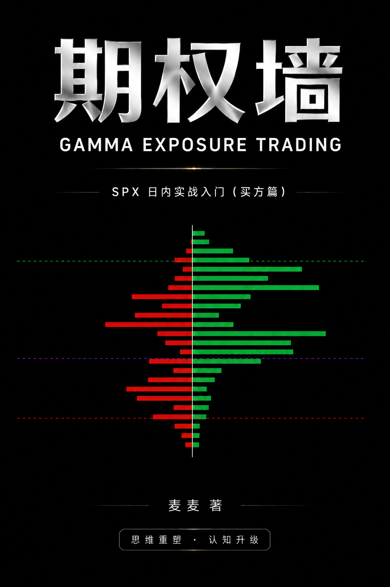

<a id="top"></a>

<div align="center">
  <p><strong>中文</strong> · <a href="#english">English</a></p>
  

  <h1>期权墙 · 买方篇</h1>

  <p><strong>从猜方向，转向读结构。</strong></p>
  <p>一本关于 GEX、做市商对冲与 SPX 0DTE 实战的中文网页书。</p>

  <p>
    <a href="https://book.myspx.trade/"><strong>在线阅读</strong></a>
    ·
    <a href="#内容地图">内容地图</a>
    ·
    <a href="#本地运行">本地运行</a>
    ·
    <a href="LICENSE.md">许可</a>
  </p>

  <p>
    
    
    
  </p>
</div>

---

## 这本书是什么

这不是喊单，也不是收益展示。这里写的是我怎么看结构，怎么进场、出场，也写判断失误与亏损。

全书围绕一个转变展开：不再执着于预测“今天涨还是跌”，而是先判断市场处在什么结构、波动如何被对冲流放大或压制，以及当前环境是否值得交易。

书中包含 **9 章正文、7 个交易日复盘**，并配有 GEX 图、结构示意图和实战速查表。

> **范围说明：** 本书只讨论买方视角，以 SPX 当天到期（0DTE）的单腿 Long Call / Long Put 为主；多腿组合与卖方策略不在本书范围内。

> **翻译说明：** 本书初稿以中文写成，英文版由 GPT-5.6 sol 大模型翻译。如发现术语、机制或表达上的不足，欢迎提交 Issue 或 PR 指正，谢谢。

## 你会读到什么

- 做市商为什么需要 Delta 对冲，以及正负 Gamma 如何改变市场性格
- Call Wall、Put Wall、Gamma Flip 应该怎样读，又会在什么情况下失效
- 0DTE 中 Vanna、Charm、Theta 与 Pin 对盘面的影响
- 如何把 GEX、VWAP 和价格行为组合成一套盘前与盘中框架
- 七个真实交易日中，结构、执行和心理如何共同决定结果
- 如何处理止损、分批出场、事件日、仓位和大赚大亏后的冷却期

## 内容地图

| 部分 | 内容 |
| --- | --- |
| 导读 | 半小时认识 GEX 地图与三根关键线 |
| 第 1 章 | Gamma 很强时，为什么市场里仍有人逆势 |
| 第 2 章 | 做市商、对冲反馈与 GEX 的底层机制 |
| 第 3 章 | 三价位、会动的墙，以及 0DTE 时钟 |
| 第 4 章 | 墙边的两种走法：假跌破与真突破 |
| 第 5 章 | 盘前功课：期权墙、VWAP 与价格行为 |
| 第 6 章 | 深 V、共振与墙塌：三种市场性格 |
| 第 7 章 | 出场、事件与仓位：活着比赢一把重要 |
| 第 8 章 | 流动性猎杀：心理墙撞上期权墙 |
| 第 9 章 | 从猜方向，转向读结构 |
| 终章与附录 | 概率、结构、执行；术语与实战速查 |

## 在线阅读

网页版本为长文阅读设计，支持中英文切换、响应式布局、章节导航、阅读进度、字号调节和深色模式；默认显示中文。

### [打开《期权墙 · 买方篇》网页版 →](https://book.myspx.trade/)

## 本地运行

需要 Node.js 22.13 或更高版本，以及 pnpm。

```bash
git clone https://github.com/kain26/options-wall-book.git
cd options-wall-book
pnpm install
pnpm dev
```

生产构建：

```bash
pnpm build
pnpm preview
```

## 项目结构

```text
content/chapters/   书籍正文
public/images/      封面与正文插图
src/                网页阅读器
```

## 许可

- 网站代码与构建配置：MIT License
- `content/` 中的原创正文：CC BY-NC-SA 4.0
- 图片与截图：除非另有标注，不纳入上述许可

完整条款见 [LICENSE.md](LICENSE.md)。

## 风险提示

本书是个人交易思维笔记与历史复盘，不构成证券投资咨询、交易建议或收益保证。SPX 0DTE 期权可能在到期日价值归零，读者应独立判断并自行承担交易风险。

---

<div align="center">
  <sub>方向是人猜的。结构是市场给的。</sub>
</div>

---

<a id="english"></a>

<div align="center">
  <p><a href="#top">中文</a> · <strong>English</strong></p>
  <h1>Options Wall · Buyer Edition</h1>
  <p><strong>Stop guessing direction. Start reading structure.</strong></p>
  <p>A Chinese-English web book about GEX, market-maker hedging, and SPX 0DTE trading.</p>
  <p>
    <a href="https://book.myspx.trade/en/"><strong>Read in English</strong></a>
    ·
    <a href="https://book.myspx.trade/"><strong>阅读中文版</strong></a>
  </p>
</div>

## What This Book Is

This is not a signal service or a highlight reel. It documents how I read structure, enter and exit trades, and deal with bad calls and losses.

The book is built around one shift in perspective: stop obsessing over whether the market will rise or fall today. First identify the market structure, understand whether hedging flow is absorbing or amplifying movement, and decide whether the environment supports a trade at all.

It includes **nine core chapters and seven historical trade reviews**, supported by GEX charts, structural diagrams, a glossary, and a practical checklist.

> **Scope:** This is the Buyer Edition. It focuses on single-leg SPX 0DTE Long Calls and Long Puts. Multi-leg structures and option-selling strategies are outside the scope of this edition.

> **Translation note:** The original manuscript was written in Chinese, and the English edition was translated by the GPT-5.6 sol model. If you find an issue with the terminology, mechanics, or wording, please open an Issue or PR. Corrections are welcome—thank you.

## Topics

- Why market makers delta hedge, and how positive and negative gamma change market behavior
- How to read Call Wall, Put Wall, and Gamma Flip—and recognize when those levels fail
- How Vanna, Charm, Theta, and Pin affect the 0DTE session
- How to combine GEX, VWAP, and price action into a premarket and intraday framework
- How structure, execution, and psychology interact across seven real trading days
- Stops, staged exits, event risk, position sizing, and cooling-off rules after large wins or losses

## Read Online

The responsive reader includes chapter navigation, reading progress, font controls, dark mode, and a Chinese-English language switch. Chinese remains the default language.

### [Open the English Buyer Edition →](https://book.myspx.trade/en/)

## Run Locally

Requires Node.js 22.13 or newer and pnpm.

```bash
git clone https://github.com/kain26/options-wall-book.git
cd options-wall-book
pnpm install
pnpm dev
```

Production build:

```bash
pnpm build
pnpm preview
```

## License

- Website source and build configuration: MIT License
- Original writing under `content/`: CC BY-NC-SA 4.0
- Images and screenshots: excluded unless separately stated

See [LICENSE.md](LICENSE.md) for the full terms.

## Risk Disclosure

This book is a collection of personal trading notes and historical reviews. It is not investment advice, a signal service, or a performance guarantee. SPX 0DTE options can expire worthless. Readers are responsible for their own decisions and risk.

---

<div align="center">
  <sub>Direction is guessed. Structure is given by the market.</sub>
</div>
